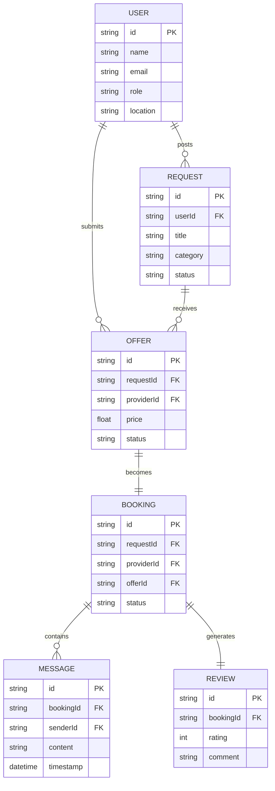

# Component 5: ERD Using Crow's Foot Notation

This document defines the data architecture and relationships within the Local Service Marketplace System (LSMS).

---

## 1. Entity-Relationship Diagram (Mermaid)

---

## 2. Entities & Cardinality

| Relationship | Cardinality | Explanation |
| :--- | :--- | :--- |
| **User to Request** | **One-to-Many (1:N)** | One HomeOwner can post multiple job requests over time. |
| **Request to Offer** | **One-to-Many (1:N)** | One job request can receive multiple price bids from different providers. |
| **Offer to Booking** | **One-to-One (1:1)** | Once an offer is accepted, it transitions into exactly one active booking. |
| **Booking to Message** | **One-to-Many (1:N)** | An active booking (chat channel) can contain many messages. |
| **Booking to Review**| **One-to-One (1:1)** | A finished booking can have exactly one rating and review. |

---

## 3. Data Dictionary (Keys & Attributes)

*   **Primary Keys (PK)**: Every entity (User, Request, Offer, etc.) has a unique `id` (MongoDB `_id`).
*   **Foreign Keys (FK)**:
    *   `Request.userId`: Links a job to the owner who posted it.
    *   `Offer.requestId`: Links a bid to the job it was sent for.
    *   `Booking.offerId`: Links the final job to the specific price agreement.
    *   `Message.bookingId`: Links chat content to a specific job session.

---

## 4. Visual Generation Prompt
If you need to generate a high-quality visual diagram for your presentation, use this prompt in **Mermaid Live Editor** or any AI image generator:

> "Generate a Crow's Foot ERD for a Service Marketplace. Entities: User (PK: id, name, role), Request (PK: id, FK: userId, title, status), Offer (PK: id, FK: requestId, FK: providerId, price), Booking (PK: id, FK: offerId, status), Message (PK: id, FK: bookingId, content). Show 1:N relationships between User and Request, Request and Offer, and Booking and Message. Show 1:1 relationship between Offer and Booking."

---

### Evaluation Quick-Check (Component 5)
*   **Main Entities:** User, Request, Offer, Booking, Message, Review.
*   **Primary Key:** The `_id` field in MongoDB (automatically generated and unique).
*   **Foreign Key Example:** `requestId` inside the `Offer` collection points to the original job.
*   **One-to-Many Relationship:** One **Request** can have many **Offers**. This allows homeowners to compare multiple prices.
*   **Why this relationship?** To support the "InDrive" business model where competition drives the best price for the user.
