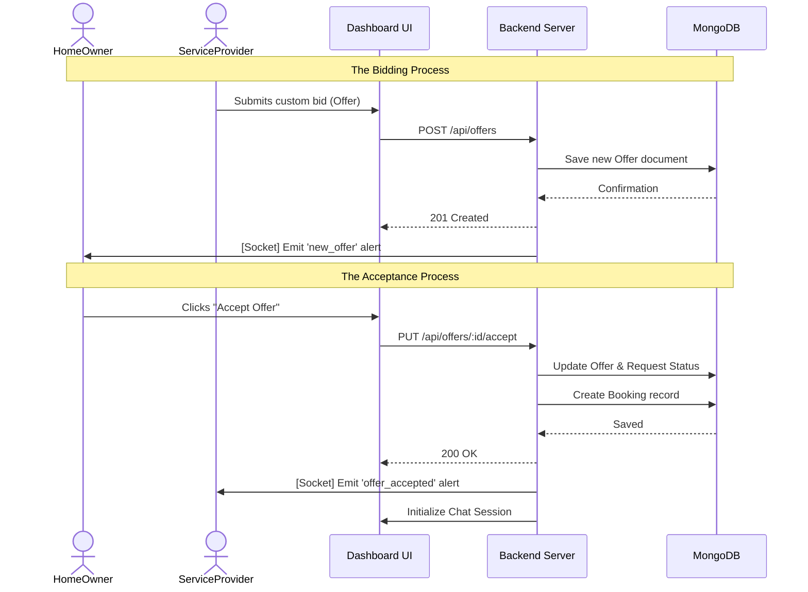
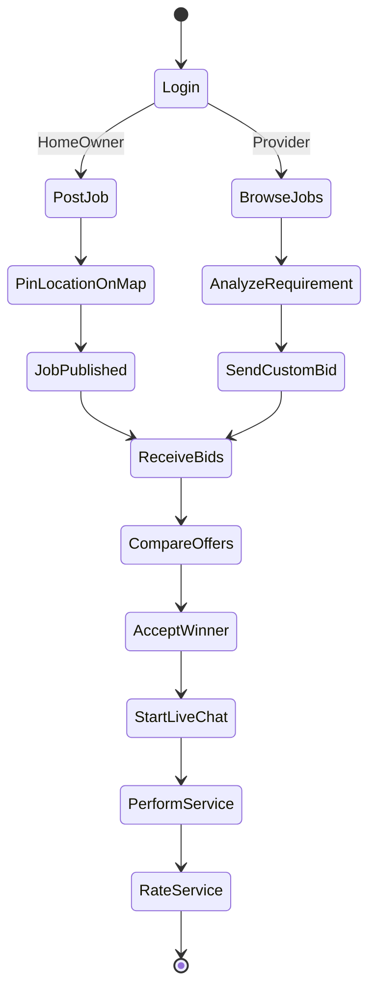

# Component 6: UML, Use Case & Sequence Diagrams

This document visually represents the interactions, workflows, and logical message passing within the LSMS platform.

---

## 1. Use Case Diagram
This diagram shows the relationship between users (Actors) and the primary functions of the system.

```mermaid
useCaseDiagram
    actor "HomeOwner" as HO
    actor "ServiceProvider" as SP

    package "LSMS System Boundary" {
        usecase "Register / Login" as UC1
        usecase "Post Job Request (Map)" as UC2
        usecase "Browse Jobs" as UC3
        usecase "Send Price Offer (Bid)" as UC4
        usecase "Accept / Reject Offer" as UC5
        usecase "Real-time Chat" as UC6
        usecase "Rate & Review Service" as UC7
    }

    HO --> UC1
    HO --> UC2
    HO --> UC5
    HO --> UC6
    HO --> UC7

    SP --> UC1
    SP --> UC3
    SP --> UC4
    SP --> UC6
```

---

## 2. Sequence Diagram (Bidding & Acceptance Flow)
This diagram shows how messages travel step-by-step from the UI to the Database.



---

## 3. Activity Diagram (Service Request Workflow)
This diagram outlines the sequential logic of the platform's core task.



---

## 4. Visual Generation Prompts

### For Use Case Diagram:
> "Create a Use Case Diagram for a Service Marketplace. Actors: HomeOwner and ServiceProvider. Use Cases: Post Job, Send Bid, Accept Bid, Real-time Chat. Show that both actors can Chat, but only HomeOwner can Post Jobs."

### For Sequence Diagram:
> "Generate a Sequence Diagram for a bidding system. Steps: Provider sends bid to UI -> UI calls API -> API saves to MongoDB -> API notifies HomeOwner via WebSocket. Then HomeOwner accepts bid -> API updates status -> API opens Chat room."

---

### Evaluation Quick-Check (Component 6)
*   **Who are your actors?** HomeOwner (Posts jobs) and ServiceProvider (Bids on jobs).
*   **Main Use Case?** The "Accept Offer" use case, as it triggers the transition from negotiation to actual work.
*   **Explain the Sequence Flow:** When a provider bids, the UI sends a POST request to the server, which saves it to MongoDB and instantly pushes a notification to the owner's screen using Socket.io.
*   **Which component sends requests to the database?** The **Backend Server (Controllers)**. The UI never talks to the DB directly for security reasons.
*   **What happens after the user submits data?** The system validates the input, saves it persistently, and triggers a real-time event to notify the relevant party.
