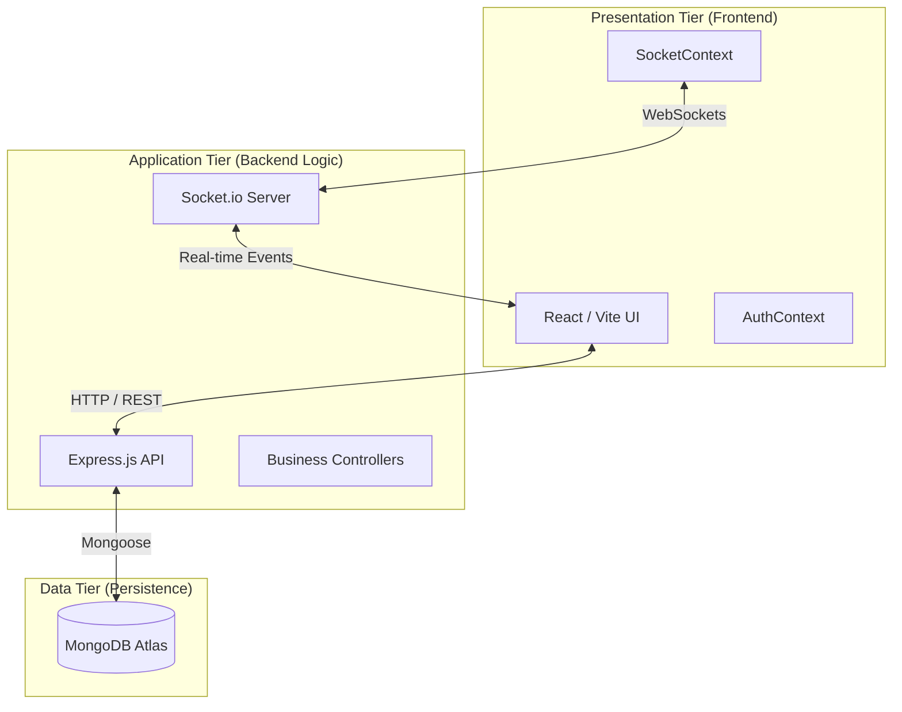

# Component 7: Architecture, Design Decisions & System Quality

This document explains the high-level blueprint of LSMS and the software engineering principles used to ensure a maintainable and robust system.

---

## 1. Architecture Type: 3-Tier System
LSMS follows a classic **3-Tier Architecture**, ensuring clear separation between the user interface, business logic, and data storage.

---

## 2. Design Decisions & Rationale

| Decision | Technology | Rationale |
| :--- | :--- | :--- |
| **Real-time Engine** | **Socket.io** | Necessary for the "InDrive" experience where bids and chat messages must appear instantly without page refreshes. |
| **Mapping Engine** | **Leaflet / OSM** | Open-source and highly flexible for custom pin-dropping and reverse geocoding compared to proprietary alternatives. |
| **Styling Strategy** | **Tailwind CSS** | Provides a highly cohesive utility-first approach that ensures the UI is responsive and premium looking with minimal CSS debt. |

---

## 3. Software Engineering Quality (Coupling & Cohesion)

### **A. High Cohesion**
*   **Definition**: Each module performs exactly one specialized task.
*   **Example in LSMS**: The `offerController.js` is highly cohesive. It handles only bidding logic (creating offers, accepting offers). It does not handle authentication or map rendering, which are delegated to their own specialized modules.

### **B. Low Coupling**
*   **Definition**: Modules are independent; changes in one do not break the others.
*   **Example in LSMS**: The **Map Component** (`MapPicker.jsx`) is loosely coupled with the **Chat System**. The Map only cares about coordinates, and the Chat only cares about text messages. They communicate only through the shared database state, meaning we could replace the Map library without ever touching the Chat code.

---

## 4. Trade-off Discussion: Polling vs. WebSockets
One major trade-off we made was in **System Dynamism**:
*   **The Decision**: We used **Socket.io** for high-priority events (New Bids, Chat) but maintained **5-second Polling** for dashboard metrics.
*   **The Trade-off**: While WebSockets are faster, they consume more server memory for keeping connections open. By using polling for metrics, we reduced the server load while still providing a "live" feel, ensuring that the system remains stable even with many concurrent users.

---

### Evaluation Quick-Check (Component 7)
*   **Explain your architecture:** It is a **3-Tier Architecture** consisting of a React Frontend, a Node.js Backend, and a MongoDB Cloud Database.
*   **Where is your logic layer?** In the **Backend Controllers**. They enforce the business rules (like "No duplicate bids") before the data reaches the DB.
*   **Give one example of low coupling:** The `NotificationDropdown` is independent of the `AuthContext`. It just listens for events and doesn't care how the user logged in.
*   **Give one example of high cohesion:** The `messageController` is dedicated only to chat persistence and retrieval.
*   **What trade-off did you make?** We traded the raw speed of pure WebSockets for a hybrid approach (Polling + Sockets) to ensure server stability and lower memory usage.
